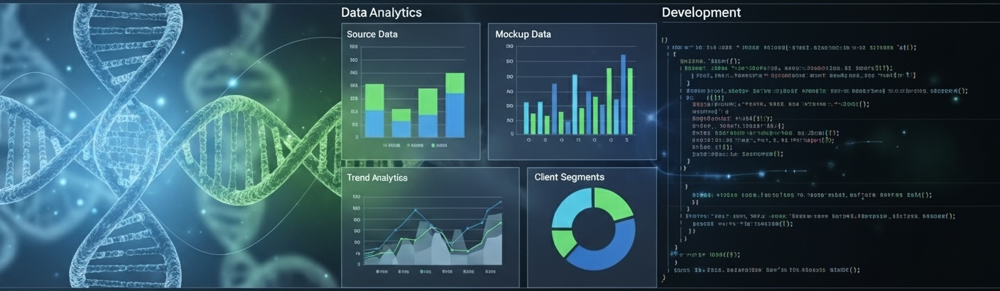

  

## Welcome!

My name is Melkamu Woldemariam and I am a scientist turned software engineer who is passionate about data-driven decision making and creating digital products that enhance business operations and user experience.

I am fluent in full-stack development using the MERN Stack and data analytics using Python, R, mySQL, mongoDB, Tableau and SPSS. More importantly, I am a lifelong learner who is passionate about the tech space and a futurist who aspires to be part of next-generation technological innovations. 

I have built and deployed digital products for public use and I am, currently, working on several full-stack and data analytics projects that are ready for deployment. 

## Technical/programming skills:

  |  **Full-stack**    |     **Data Analytics**    |
  | -----------------  | ------------------------- |
  |      React         |          Python           |
  |      Node.js       |            R              |
  |    Express.js      |          SPSS             |
  |       CSS          |           JMP             |
  |     MongoDB        |         MongoDB           |
  |    Tailwind CSS    |          MySQL            |
  |       HTML         |          Tableau          |
  |       React        |                           |
  |      JWT           |                           |

# Project Management:
- JIRA/Atlassian
- Agile frameworks

## How to reach me:
- LinkedIn: www.linkedin.com/in/melkamuwoldemariam
<!--
**MelkWold/MelkWold** is a ✨ _special_ ✨ repository because its `README.md` (this file) appears on your GitHub profile.

Here are some ideas to get you started:

- 🔭 I’m currently working on ...
- 🌱 I’m currently learning ...
- 👯 I’m looking to collaborate on ...
- 🤔 I’m looking for help with ...
- 💬 Ask me about ...
- 📫 How to reach me: ...
- 😄 Pronouns: ...
- ⚡ Fun fact: ...
-->
