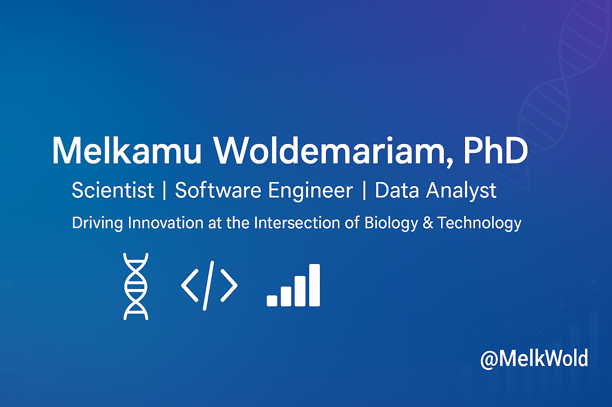

  

## Welcome!

My name is Melkamu Woldemariam and I am a scientist turned software engineer, skilled across the stack and fluent in HTML, CSS, JavaScript, React, Node.js, and Python. I am experienced with data analytics using Python, R, mySQL, mongoDB, Tableau and SPSS. I am passionate about data-driven decision making and creating digital products that enhance business operations and user experience. 

Currently, I am working on three full-stack projects that are ready for deployment. I have also deployed two digital products for public use. 

<!--
**MelkWold/MelkWold** is a ✨ _special_ ✨ repository because its `README.md` (this file) appears on your GitHub profile.

Here are some ideas to get you started:

- 🔭 I’m currently working on ...
- 🌱 I’m currently learning ...
- 👯 I’m looking to collaborate on ...
- 🤔 I’m looking for help with ...
- 💬 Ask me about ...
- 📫 How to reach me: ...
- 😄 Pronouns: ...
- ⚡ Fun fact: ...
-->
